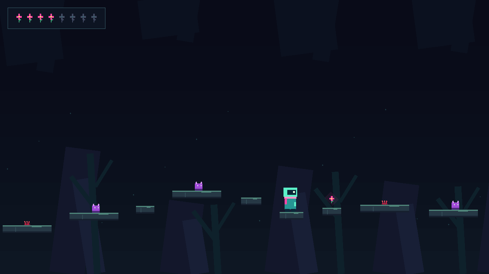
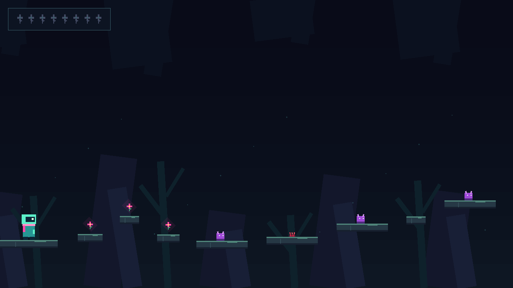
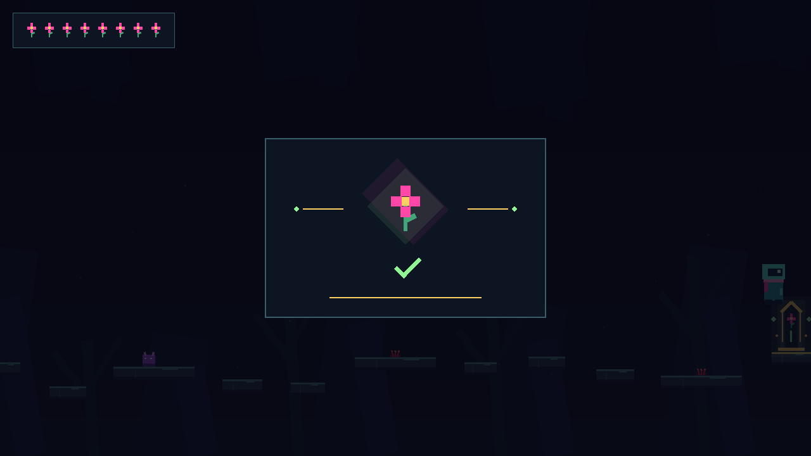
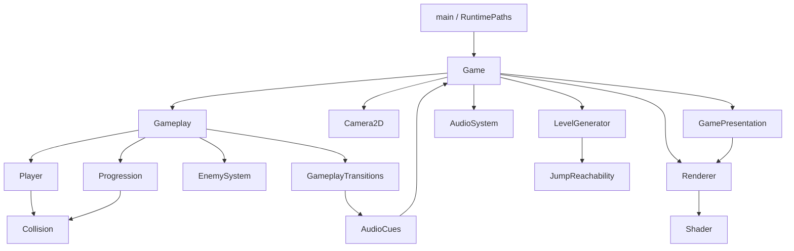

# CavernBloom

A playable C++20/OpenGL platformer that builds a scrolling cavern around the player's jump physics. Its procedural route is checked analytically and exercised by automated simulation across 1,000 deterministic seeds.



**Portfolio release / playable prototype | Windows runtime verified | C++20 / OpenGL 3.3**

## Highlights

- Physics-aware generation of 28-platform worlds, with conservative jump margins and bounded fallback placement.
- Deterministic player simulation at **120 Hz**, independent of rendering and camera state.
- **27,000 generated jumps** tested with the real player and AABB collision code across **1,000 seeds**.
- Original procedural geometry, layered scrolling backgrounds, a flower HUD, and a completion presentation.
- Seeded flowers, patrol enemies, thorn hazards, and restartable progression.
- **11 headless CTest suites**, plus a Windows build-and-test workflow.
- Four licensed Kenney CC0 sound effects with graceful audio failure handling.

## Gameplay

Collect eight flowers, avoid patrols and thorns, then reach the unlocked shrine. Contact or falling respawns the player while retaining flowers; restart restores the same seed and clears progress. The current executable uses a fixed seed so runs are repeatable.

| Input | Action |
| --- | --- |
| A/D or Left/Right | Move |
| Space | Jump while grounded |
| R | Restart the current level |
| Escape | Exit |

## Screenshots

| Start | Mid-level | Completion |
| --- | --- | --- |
|  |  |  |

## Technical Design

Platform candidates use the ballistic model:

```text
dy = v*t + 0.5*g*t^2
```

`JumpReachability` uses the same gravity (**-1800 units/s^2**), jump velocity (**650 units/s**), and horizontal speed (**280 units/s**) as `Player`. It chooses the descending landing time, reserves **20%** of theoretical horizontal travel and apex height, and requires **80%** player-width support at takeoff and landing.

Continuous feasibility is only the first check. Tests traverse every generated transition using the real 120 Hz movement and collision implementation, catching differences caused by discrete integration and platform geometry. These checks validate geometric reachability; they do not guarantee avoidance of moving enemies.

A local seeded RNG controls layouts. Camera following, procedural decoration, and audio remain separate from simulation. OpenGL resources and audio resources have explicit RAII owners. More detail is in [Technical notes](docs/TECHNICAL_NOTES.md).

## Architecture



`Game` coordinates input, the accumulator loop, and resource ownership. `Gameplay` advances the fixed-step session and reports transitions; it has no OpenGL or miniaudio dependency. `GamePresentation` draws through one shared indexed rectangle pipeline. `RuntimePaths` locates resources beside the executable.

## Testing

| Automated coverage | Validated count |
| --- | ---: |
| CTest suites | 11 |
| Deterministic seeds | 0-999 |
| Generated transitions simulated | 27,000 |
| Flower placements | 8,000 |
| Enemy placements | 6,000 |
| Hazard placements | 4,000 |
| Patrol updates | 7.2 million, plus replay validation |

Focused suites also cover collision boundaries, camera behavior, exact-once collection/winning, respawn/restart, presentation layout, and sound mapping. CTest opens no window and requires no audio device. [Windows CI](.github/workflows/ci.yml) configures, builds Release, and runs the tests on pushes and pull requests; its first hosted run is pending publication of these changes.

## Build

Use Visual Studio 2022 or newer with **Desktop development with C++**, a Windows SDK, CMake **3.25+**, Git, and Python **3.12**. Run from a Developer PowerShell; the first configure downloads dependencies.

```powershell
python -m venv .venv
.\.venv\Scripts\python.exe -m pip install Jinja2==3.1.6
$env:VIRTUAL_ENV = "$PWD\.venv"
$env:PATH = "$env:VIRTUAL_ENV\Scripts;$env:PATH"
cmake -S . -B build -A x64
cmake --build build --config Debug
ctest --test-dir build -C Debug --output-on-failure
.\build\Debug\CavernBloom.exe
```

Pinned dependencies: **GLFW 3.4**, **GLAD 2.0.8**, **GLM 1.0.1**, **miniaudio 0.11.23**, and GLAD's **Jinja2 3.1.6**. Dependency sources and generated loaders stay in the build tree. Resource files are copied beside the executable on each build.

## Portable Release

```powershell
cmake -S . -B build-release -A x64
cmake --build build-release --config Release
ctest --test-dir build-release -C Release --output-on-failure
cmake --install build-release --config Release --prefix build-release/install
cpack --config build-release/CPackConfig.cmake -C Release
```

The ZIP is written to `build-release/package/CavernBloom-0.1.0-Windows-x64.zip`. Extract the entire folder and run `CavernBloom.exe`. It loads `shaders/` and `assets/audio/` beside itself and includes `THIRD_PARTY_ASSETS.md`; neither the source tree nor the original build directory is needed. The Windows build links the MSVC runtime statically. A working OpenGL 3.3 driver and Windows desktop are still required. No public release has been published.

## Audio & Licensing

All visuals are **original procedural geometry**. The four external sound effects are **Kenney CC0** assets, played through miniaudio. Jump, pickup, damage, and win cues are driven by gameplay transitions; unavailable audio never prevents play. See [THIRD_PARTY_ASSETS.md](THIRD_PARTY_ASSETS.md) for provenance and software license choices.

## Current Scope

This is a focused playable prototype with no combat system, sprite artwork, or background music. **Windows is the verified runtime target**; Linux/macOS paths are implemented, but their builds and runtime behavior have not been verified. CMake reports existing upstream GLM compatibility deprecation warnings.
